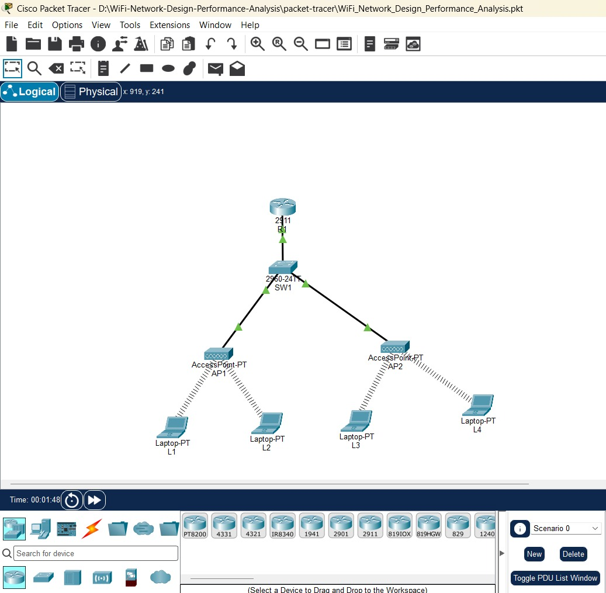
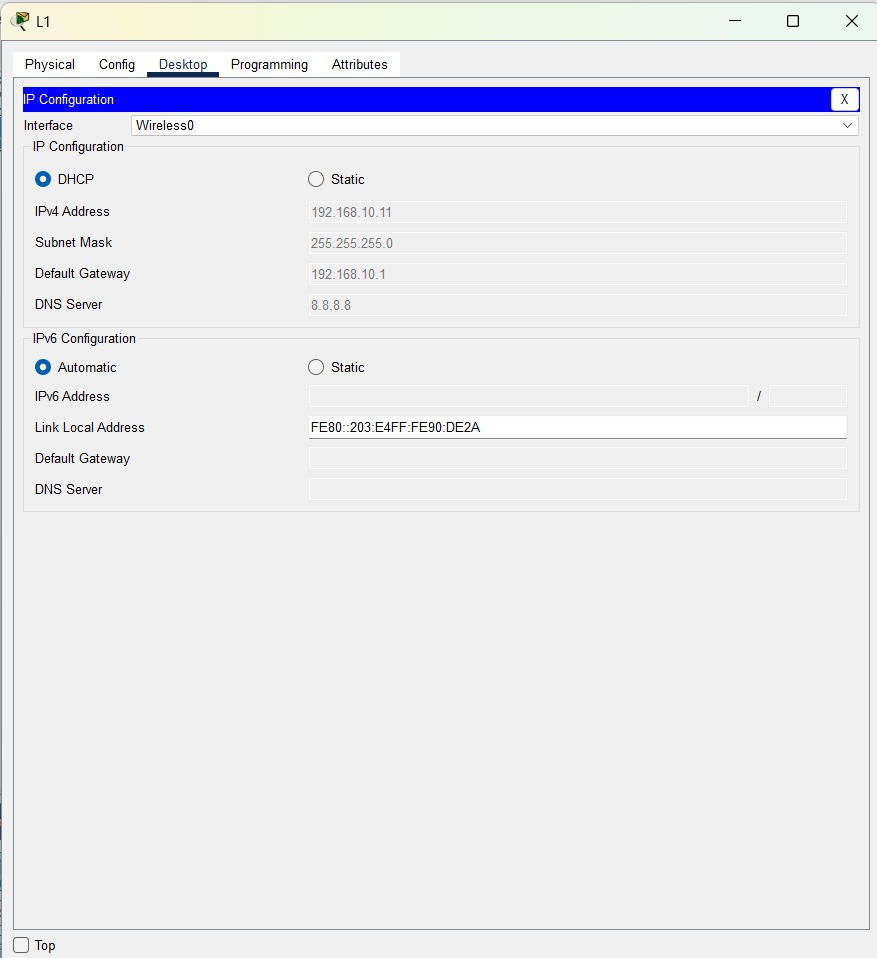
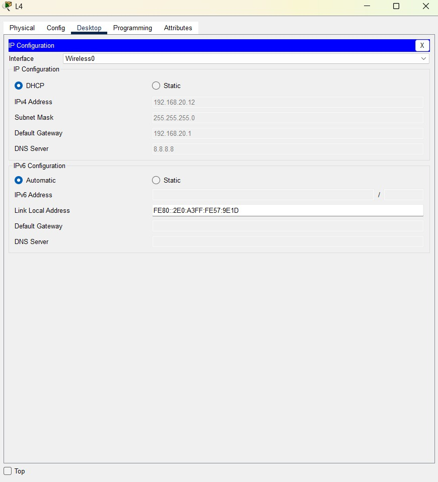
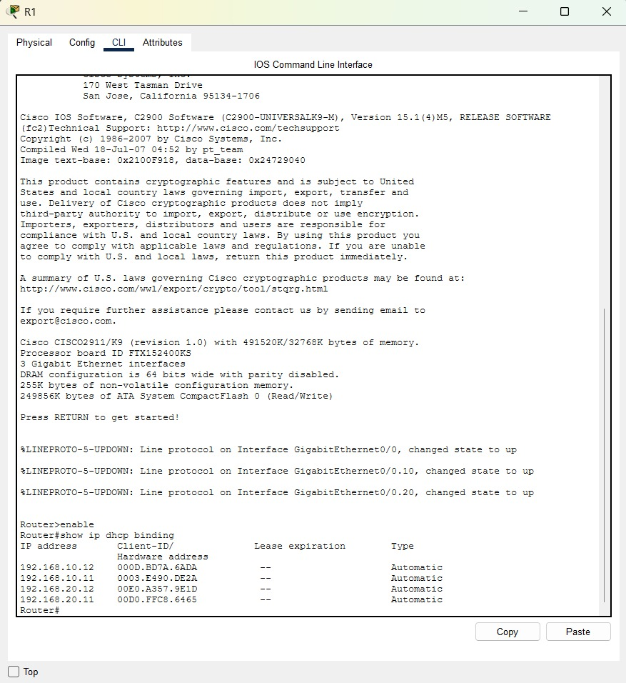

# Wi-Fi Network Design & Wireless Performance Analysis

A Cisco Packet Tracer project demonstrating the design, configuration, and validation of a segmented enterprise-style Wi-Fi network using VLANs, DHCP, WPA2-PSK, router-on-a-stick inter-VLAN routing, and ACL-based Guest network isolation.

## Project Overview

This project simulates a small enterprise wireless network with separate Employee and Guest wireless networks.

The network was designed and tested in Cisco Packet Tracer to demonstrate practical concepts in:

- Computer Networks
- Wireless Networking
- IPv4 Addressing
- DHCP
- VLAN Segmentation
- IEEE 802.1Q Trunking
- Router-on-a-Stick Inter-VLAN Routing
- IEEE 802.11 Wireless Networking
- WPA2-PSK Wireless Security
- 2.4 GHz Channel Planning
- Extended ACLs
- Guest Network Isolation
- Network Connectivity and Configuration Verification

## Objectives

The main objectives of this project are:

1. Design a small wireless network using Cisco Packet Tracer.
2. Separate Employee and Guest users using VLANs.
3. Provide automatic IPv4 addressing using DHCP.
4. Configure inter-VLAN routing using router-on-a-stick.
5. Configure WPA2-PSK security for wireless networks.
6. Use different 2.4 GHz channels for the two access points.
7. Prevent Guest users from accessing the Employee network using an extended ACL.
8. Verify the network using connectivity tests and Cisco IOS commands.

## Network Topology

```text
                    R1
                     |
                    SW1
                  /     \
                AP1     AP2
               /  \     /  \
             L1   L2   L3   L4
```

### Devices Used

| Device | Model | Quantity | Purpose |
|---|---|---:|---|
| Router | Cisco 2911 | 1 | Inter-VLAN routing, DHCP, ACL |
| Switch | Cisco 2960 | 1 | VLAN segmentation and trunking |
| Access Point | AP-PT | 2 | Employee and Guest wireless access |
| Laptop | Wireless Laptop | 4 | Wireless client testing |

### Device Naming

- R1 — Router
- SW1 — Switch
- AP1 — Employee Access Point
- AP2 — Guest Access Point
- Laptop-HR1 — Employee client
- Laptop-HR2 — Employee client
- Laptop-IT1 — Guest client
- Laptop-IT2 — Guest client

## Network Architecture

The network is divided into two logical IPv4 networks using VLAN segmentation.

| VLAN | Name | Network | Subnet Mask | Default Gateway | Purpose |
|---|---|---|---|---|---|
| 10 | EMPLOYEE | 192.168.10.0/24 | 255.255.255.0 | 192.168.10.1 | Employee wireless clients |
| 20 | GUEST | 192.168.20.0/24 | 255.255.255.0 | 192.168.20.1 | Guest wireless clients |

R1 provides:

- Inter-VLAN routing
- DHCP services
- Guest network access control

SW1 provides:

- VLAN segmentation
- IEEE 802.1Q trunking
- Access-port connectivity to the access points

## IP Addressing

### Router Interfaces

| Device | Interface | VLAN | IP Address | Purpose |
|---|---|---:|---|---|
| R1 | G0/0.10 | 10 | 192.168.10.1/24 | Employee gateway |
| R1 | G0/0.20 | 20 | 192.168.20.1/24 | Guest gateway |

R1 uses router-on-a-stick to route traffic between VLAN 10 and VLAN 20.

## Switch Port Configuration

| Switch Port | Mode | VLAN | Connected Device |
|---|---|---:|---|
| Fa0/1 | Trunk | 10, 20 | R1 |
| Fa0/2 | Access | 10 | AP1 |
| Fa0/3 | Access | 20 | AP2 |

The R1-to-SW1 connection uses IEEE 802.1Q VLAN tagging.

## Wireless Configuration

Two separate wireless networks were configured using Cisco AP-PT access points.

| Access Point | SSID | VLAN | Frequency | Channel | Security |
|---|---|---:|---|---:|---|
| AP1 | Company-Employee | 10 | 2.4 GHz | 6 | WPA2-PSK / AES |
| AP2 | Company-Guest | 20 | 2.4 GHz | 11 | WPA2-PSK / AES |

Different 2.4 GHz channels were selected for the two access points to reduce overlapping-channel interference.

Wireless passphrases are intentionally not included in this public repository.

## DHCP Configuration

R1 provides DHCP services for both wireless networks.

### Employee Network

- Network: `192.168.10.0/24`
- Default gateway: `192.168.10.1`
- DNS server: `8.8.8.8`
- Reserved addresses: `192.168.10.1 - 192.168.10.10`

### Guest Network

- Network: `192.168.20.0/24`
- Default gateway: `192.168.20.1`
- DNS server: `8.8.8.8`
- Reserved addresses: `192.168.20.1 - 192.168.20.10`

## Example DHCP Leases

During testing, the following client addresses were observed:

| Client | Network | Example IP Address |
|---|---|---|
| Laptop-HR1 | Employee | 192.168.10.11 |
| Laptop-HR2 | Employee | 192.168.10.12 |
| Laptop-IT1 | Guest | 192.168.20.12 |
| Laptop-IT2 | Guest | 192.168.20.13 |

These addresses are DHCP-assigned and may change if the leases are renewed or the Packet Tracer simulation is restarted.

## Guest Network Isolation

An extended ACL named `GUEST_ISOLATION` was configured on R1.

The ACL prevents traffic originating from the Guest subnet from reaching the Employee subnet.

```text
ip access-list extended GUEST_ISOLATION
 deny ip 192.168.20.0 0.0.0.255 192.168.10.0 0.0.0.255
 permit ip any any
```

The ACL is applied inbound to the Guest VLAN interface:

```text
interface GigabitEthernet0/0.20
 ip access-group GUEST_ISOLATION in
```

This allows Guest clients to communicate normally with permitted destinations while specifically blocking Guest-to-Employee subnet traffic.

## Testing and Validation

The network was tested in Cisco Packet Tracer after completing the configuration.

### DHCP Validation

The router successfully assigned IPv4 addresses to four wireless clients.

DHCP leases were verified using:

```text
show ip dhcp binding
```

### Employee Connectivity

Laptop-HR1 successfully reached the Employee default gateway:

```text
ping 192.168.10.1
```

Result:

- Sent: 4
- Received: 4
- Lost: 0
- Packet loss: 0%

The Employee client also successfully reached the Guest VLAN gateway:

```text
ping 192.168.20.1
```

Result:

- Sent: 4
- Received: 4
- Lost: 0
- Packet loss: 0%

This confirms that inter-VLAN routing is functioning.

### Guest Connectivity

Laptop-IT2 successfully reached its Guest default gateway:

```text
ping 192.168.20.1
```

Result:

- Sent: 4
- Received: 4
- Lost: 0
- Packet loss: 0%

### Guest-to-Employee Isolation

Guest traffic was tested against the Employee gateway:

```text
ping 192.168.10.1
```

The Guest client received no successful replies and the test showed 100% packet loss.

This confirms that the `GUEST_ISOLATION` ACL is blocking traffic from the Guest subnet toward the Employee subnet.

### ACL Verification

The ACL was verified using:

```text
show access-lists GUEST_ISOLATION
```

The deny rule recorded matches during testing, confirming that Guest-to-Employee traffic was processed by the ACL.

### Switch Verification

The following commands were used:

```text
show vlan brief
show interfaces trunk
```

The results confirmed:

- VLAN 10 `EMPLOYEE` assigned to Fa0/2
- VLAN 20 `GUEST` assigned to Fa0/3
- Fa0/1 operating as an IEEE 802.1Q trunk
- VLANs 10 and 20 active on the trunk

## Verification Commands

The following Cisco IOS commands were used during testing and validation:

```text
show ip interface brief
show ip dhcp binding
show access-lists GUEST_ISOLATION
show vlan brief
show interfaces trunk
```

Client connectivity was tested using:

```text
ping 192.168.10.1
ping 192.168.20.1
```

## Project Structure

```text
WiFi-Network-Design-Performance-Analysis/
│
├── README.md
│
├── packet-tracer/
│   └── WiFi_Network_Design_Performance_Analysis.pkt
│
├── documentation/
│   ├── network-topology.png
│   ├── ip-addressing.md
│   ├── configuration.md
│   └── testing-results.md
│
└── screenshots/
    ├── topology.png
    ├── employee-wifi.png
    ├── guest-wifi.png
    ├── dhcp-leases.png
    ├── vlan-trunk.png
    └── guest-isolation.png
```

## Documentation

Detailed technical documentation is available in the `documentation` directory.

- [IP Addressing and VLAN Plan](documentation/ip-addressing.md)
- [Network Configuration](documentation/configuration.md)
- [Testing and Validation Results](documentation/testing-results.md)

## Screenshots

### Network Topology



### Employee Wireless Client



### Guest Wireless Client



### DHCP Leases



### VLAN and Trunk Verification


### Guest Network Isolation


## How to Open the Project

1. Install Cisco Packet Tracer.
2. Open the Packet Tracer file located at:

```text
packet-tracer/WiFi_Network_Design_Performance_Analysis.pkt
```

3. Review the network topology.
4. Inspect the router, switch, access point, and wireless client configurations.
5. Use the verification commands documented in `documentation/testing-results.md`.

## Technologies Used

- Cisco Packet Tracer
- Cisco IOS
- IPv4
- IEEE 802.11
- VLAN
- IEEE 802.1Q
- DHCP
- WPA2-PSK
- AES
- Router-on-a-Stick
- Extended ACL
- 2.4 GHz Wi-Fi

## Project Scope and Limitations

This project focuses on wireless network design, network segmentation, connectivity, security configuration, and validation using Cisco Packet Tracer.

The Packet Tracer AP-PT devices used in this project represent separate Employee and Guest wireless networks. The project does not implement enterprise wireless-controller-based roaming or multiple SSIDs on a single access point.

The project focuses on connectivity and configuration validation rather than real-world Wi-Fi throughput benchmarking.

## Learning Outcomes

This project provided practical experience with:

- Designing a small wireless network
- Configuring Cisco routers and switches
- Creating and assigning VLANs
- Configuring IEEE 802.1Q trunking
- Implementing router-on-a-stick inter-VLAN routing
- Configuring DHCP services
- Configuring WPA2-PSK wireless security
- Planning basic 2.4 GHz wireless channels
- Implementing extended ACLs
- Testing network connectivity
- Troubleshooting network configuration
- Documenting a network infrastructure project


